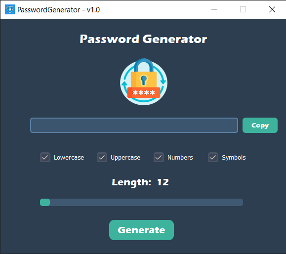

# Secure Password Generator with GUI
## Usage
> You can chooce __type__ of generating password, by clicking on checkboxes and __length__ by slider. Then click on the __"Generate"__ button and after it you can __copy__ generated password.
___
## Image Example
